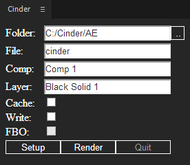

# AfterEffects-Cinder

The panel of Adobe After Effects which can control a [cinder](http://libcinder.org/) application inheriting from `atarabi:AppAE`. See also [Cinder-AfterEffects](https://github.com/atarabi/Cinder-AfterEffects) and [a movie](https://vimeo.com/128144102).

## Installation

Unzip **AfterEffects-Cinder.zxp** and place them in the **extensions** folder.

On Mac:  
~/Library/Application Support/Adobe/CEP/extensions/

On Windows:  
%APPDATA%/Adobe/CEP/extensions/

See also [After Effects CC 2014 Panel SDK](http://www.adobe.com/devnet/aftereffects/panelsdk/cc2014.html).

## Usage

1. Click the **..** button and select a folder in which an image sequence is saved.

1. With a cinder application running, select an AV layer and click the **Setup** button. The expression controls which the application requires are added to the layer.

1. Click the **Render** button, and rendering starts. If you want to quit rendering, click the **Quit** button.

### Cache

When the **Cache** checkbox is checked, the application caches the values of the expression controls which AE has sent. If you want to update the values, uncheck the checkbox.

### Write

When the **Write** checkbox is checked, the application writes out images to png files as an image sequence.

### FBO

When the **FBO** checkbox is checked, the application do off-screen rendering.

## Compatibility

Adobe After Effects CC 2014.2-

## License

MIT